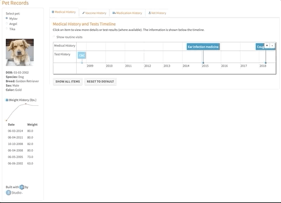
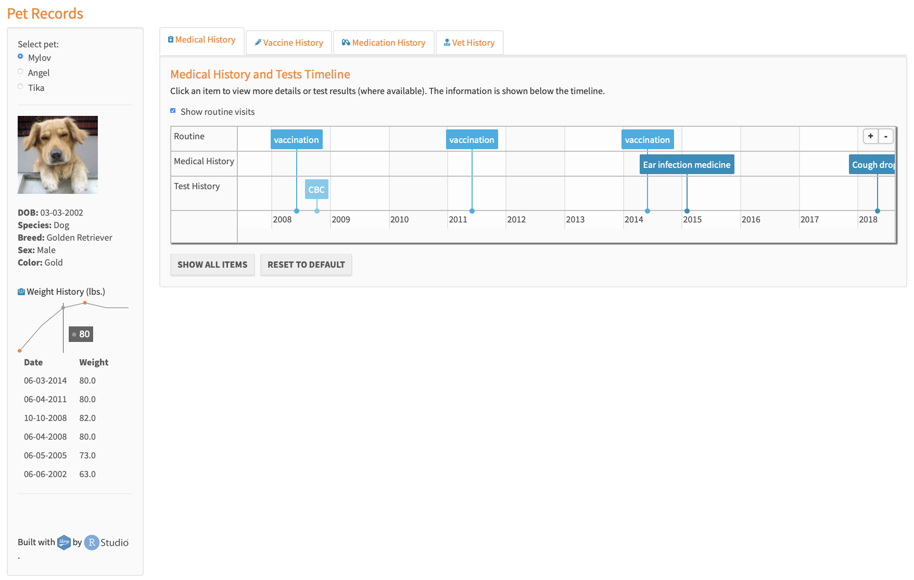
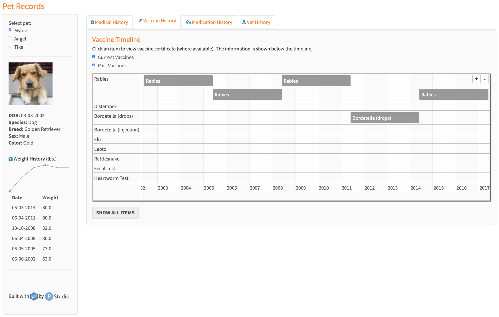
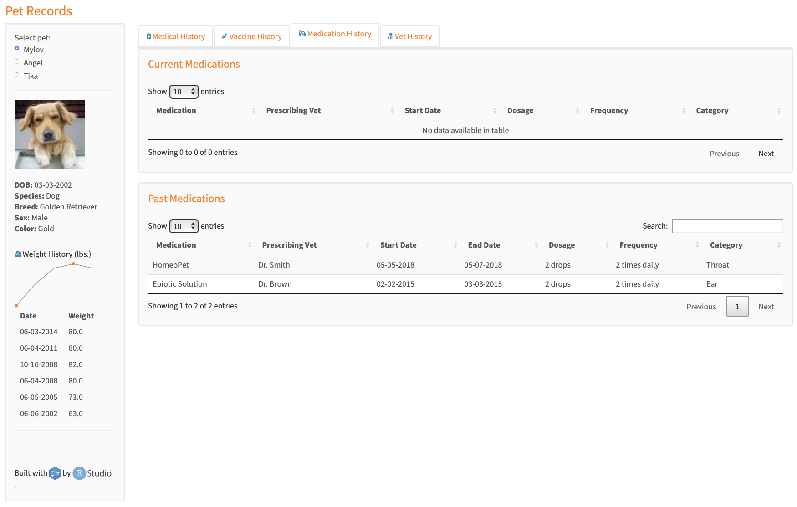
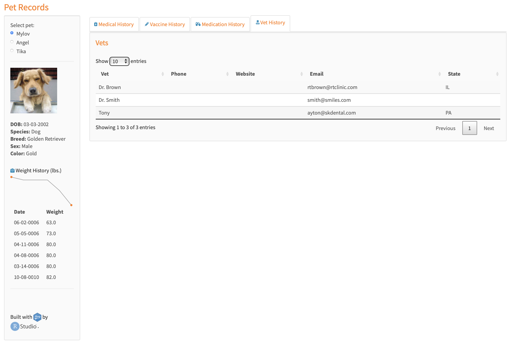

[](https://travis-ci.org/NadiaAntony/pet-days)
[](https://codecov.io/github/)
[](https://codecov.io/github/)

#### short story
As a digital nomad traveling with 2 dogs, keeping track of all their medical and vaccine records has been challenging. Especially since one of my dogs has had some recent health issues. I needed a way to keep track of all the vet visits, test results, vaccine certificates, etc. as well as be able to share them with new vets and our home base vet back in Colorado. Thus, an R shiny app was born.



#### setup

```
git clone https://github.com/lotusxai/pet-days.git
cd pet-days/
#Rscript run_requirements.R

./run_requirements.sh requirements.txt

Rscript setup_db.R
R -e "shiny::runApp(launch.browser = TRUE)"

```
run_requirements.R installs the necessary packages, runs setup_db.R, and launches the Shiny app.  
Note: The setup_db.R script contains the view and table creation scripts.

#### Screenshots






#### sessionInfo()

```
> sessionInfo()
R version 3.6.2 (2019-12-12)
Platform: x86_64-apple-darwin19.2.0 (64-bit)
Running under: macOS Catalina 10.15.3

Matrix products: default
BLAS:   /System/Library/Frameworks/Accelerate.framework/Versions/A/Frameworks/vecLib.framework/Versions/A/libBLAS.dylib
LAPACK: /usr/local/Cellar/openblas/0.3.7/lib/libopenblasp-r0.3.7.dylib

locale:
[1] en_US.UTF-8/en_US.UTF-8/en_US.UTF-8/C/en_US.UTF-8/en_US.UTF-8

attached base packages:
[1] stats     graphics  grDevices utils     datasets  methods   base

other attached packages:
 [1] fs_1.3.1              lubridate_1.7.4       RSQLite_2.1.2
 [4] magick_2.2            aws.s3_0.3.20         tibble_2.1.3
 [7] purrr_0.3.3           stringr_1.4.0         dplyr_0.8.3
[10] fontawesome_0.1.0     shinycssloaders_0.2.0 DT_0.7
[13] timevis_0.5           sparkline_2.0         shinythemes_1.1.2
[16] shiny_1.4.0

loaded via a namespace (and not attached):
 [1] Rcpp_1.0.3               compiler_3.6.2           pillar_1.4.2
 [4] later_1.0.0              base64enc_0.1-3          tools_3.6.2
 [7] zeallot_0.1.0            bit_1.1-14               digest_0.6.25
[10] memoise_1.1.0            jsonlite_1.6             pkgconfig_2.0.2
[13] rlang_0.4.4              DBI_1.0.0                rstudioapi_0.10
[16] crosstalk_1.0.0          curl_4.0                 yaml_2.2.0
[19] fastmap_1.0.1            xml2_1.2.0.9000          httr_1.4.0
[22] vctrs_0.2.0              htmlwidgets_1.5.1        bit64_0.9-7
[25] tidyselect_0.2.5         glue_1.3.1               R6_2.4.1
[28] blob_1.2.0               magrittr_1.5             backports_1.1.4
[31] promises_1.1.0           htmltools_0.4.0          assertthat_0.2.1
[34] mime_0.8                 xtable_1.8-4             aws.signature_0.5.2.9000
[37] httpuv_1.5.2             stringi_1.4.3            crayon_1.3.4
```
